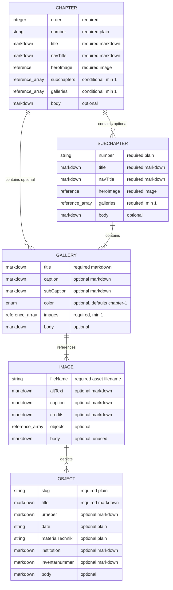

# Content Model

This document describes the Astro content collections defined in `src/content.config.ts`.

## Type Legend

| Type | Meaning |
|---|---|
| Required Markdown string | Frontmatter string that must be present and non-empty. It may contain inline Markdown such as `*italic*`. |
| Optional Markdown string | Frontmatter string that may be omitted, but must be non-empty when present. It may contain inline Markdown. |
| Plain string | Frontmatter string treated as plain data, not Markdown. |
| Body Markdown | Markdown content below the frontmatter block. Not validated by the schema unless noted here. |
| Reference | Astro content reference to another collection entry by ID. |
| Enum | String limited to predefined values. |

## Shared Section Fields

`chapters` and `subchapters` share these fields.

| Field | Type | Required | Notes |
|---|---|---:|---|
| `number` | Plain string | yes | Display number, for example `"01"` or `"01.1"`. |
| `title` | Required Markdown string | yes | Display title. Supports inline Markdown. |
| `navTitle` | Required Markdown string | yes | Navigation title. Supports inline Markdown by schema, but should usually stay simple. |
| `heroImage` | Reference to `images` | yes | Hero image entry ID. |
| body | Body Markdown | optional | Free Markdown below frontmatter. |

## Collection: `chapters`

Path: `src/content/chapters/*.md`

| Field | Type | Required | Notes |
|---|---|---:|---|
| `order` | Positive integer | yes | Sort order for chapters. |
| `number` | Plain string | yes | From shared section fields. |
| `title` | Required Markdown string | yes | From shared section fields. |
| `navTitle` | Required Markdown string | yes | From shared section fields. |
| `heroImage` | Reference to `images` | yes | From shared section fields. |
| `subchapters` | Array of references to `subchapters` | conditional | Minimum 1 item when present. |
| `galleries` | Array of references to `galleries` | conditional | Minimum 1 item when present. |
| body | Body Markdown | optional | Chapter text below frontmatter. |

Validation rule: a chapter must define either `subchapters` or `galleries`, but not both.

Example:

```yaml
---
order: 1
number: "01"
title: "Der *Dichter*"
navTitle: "Der Dichter"
heroImage: "ag-1803-title"
subchapters:
  - "allemannische-gedichte"
---
```

## Collection: `subchapters`

Path: `src/content/subchapters/*.md`

| Field | Type | Required | Notes |
|---|---|---:|---|
| `number` | Plain string | yes | From shared section fields. |
| `title` | Required Markdown string | yes | From shared section fields. |
| `navTitle` | Required Markdown string | yes | From shared section fields. |
| `heroImage` | Reference to `images` | yes | From shared section fields. |
| `galleries` | Array of references to `galleries` | yes | Minimum 1 gallery. |
| body | Body Markdown | optional | Subchapter text below frontmatter. |

Example:

```yaml
---
number: "01.1"
title: "Die *Allemannischen Gedichte*"
navTitle: "Allemannische Gedichte"
heroImage: "tschopli-hero"
galleries:
  - "allemannische-gedichte-im-bild"
---
```

## Collection: `galleries`

Path: `src/content/galleries/*.md`

| Field | Type | Required | Notes |
|---|---|---:|---|
| `title` | Required Markdown string | yes | Gallery title. Supports inline Markdown. |
| `caption` | Optional Markdown string | no | Gallery-level caption fallback. |
| `subCaption` | Optional Markdown string | no | Gallery-level subcaption fallback. |
| `color` | Enum | no | Defaults to `chapter-1`. Allowed: `chapter-1` through `chapter-7`. |
| `images` | Array of references to `images` | yes | Minimum 1 image. |
| body | Body Markdown | optional | Essay text below the gallery. Blockquotes can be written directly here. |

Blockquote convention in body Markdown:

```md
> Quote text can contain one or more paragraphs.
>
> — JPH
>
> Source or subcaption line
```

The last paragraph is treated as the source, the second-to-last paragraph as the author, and all earlier paragraphs as quote text.

Example:

```yaml
---
title: "Der *Karfunkel* als Bildfolge"
caption: "Bildzeugnisse zur Wirkungsgeschichte"
subCaption: "Diese Galerie nutzt Objekt-, Bild- und Galerie-Metadaten als Caption-Fallbacks."
color: "chapter-1"
images:
  - "carfunkel-kupfer"
  - "carfunkel-nisle"
  - "carfunkel-richter"
---
```

## Collection: `images`

Path: `src/content/images/*.md`

| Field | Type | Required | Notes |
|---|---|---:|---|
| `fileName` | Plain string | yes | Asset filename. Must end in `.avif`, `.gif`, `.jpg`, `.jpeg`, `.png`, or `.webp`. |
| `altText` | Optional Markdown string | no | Alternative text. Schema allows Markdown, but keep this plain for accessibility. |
| `caption` | Optional Markdown string | no | Image-level caption. |
| `credits` | Optional Markdown string | no | Image credit line. |
| `objects` | Array of references to `objects` | no | Object entries depicted by this image. |
| body | Body Markdown | optional | Not currently used by the gallery rendering. |

Example:

```yaml
---
fileName: "2.2_01_Zix_Carfunkel_Kupfer_1806_TSS.webp"
altText: "Kupferstich zu Der Karfunkel"
caption: "Der Karfunkel"
credits: "Theodor Springmann Stiftung"
objects:
  - "zix-carfunkel-1806"
---
```

## Collection: `objects`

Path: `src/content/objects/*.md`

| Field | Type | Required | Notes |
|---|---|---:|---|
| `slug` | Plain string | yes | Public object slug. |
| `title` | Required Markdown string | yes | Object title. Supports inline Markdown. |
| `urheber` | Optional Markdown string | no | Creator/author. |
| `date` | Plain string | no | Date or date range. Must be non-empty when present. |
| `materialTechnik` | Plain string | no | Material/technique. Must be non-empty when present. |
| `institution` | Optional Markdown string | no | Holding institution. |
| `inventarnummer` | Optional Markdown string | no | Inventory number. |
| body | Body Markdown | optional | Object description below frontmatter. |

Example:

```yaml
---
slug: "zix-carfunkel-1806"
title: "Der Karfunkel"
urheber: "Benjamin Zix"
date: "1806"
materialTechnik: "Kupferstich"
institution: "Theodor Springmann Stiftung"
inventarnummer: "Beispiel-Inventarnummer"
---
```

## Caption Fallbacks

Gallery captions are resolved from the most specific data first:

| Priority | Source | Notes |
|---:|---|---|
| 1 | `objects` metadata | Used when an image references one or more objects. |
| 2 | `images.caption` and `images.credits` | Used when image metadata exists without object metadata. |
| 3 | `galleries.caption` and `galleries.subCaption` | Gallery-level fallback. |

## Graphic


