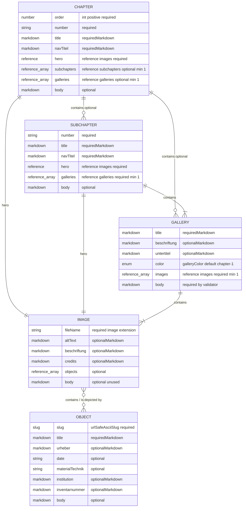

# Inhaltsmodell

Dieses Dokument beschreibt die Astro-Sammlungen aus `src/content.config.ts`.

## Kurzüberblick

| Bereich | Kurzbeschreibung |
|---|---|
| Kapitel | Ein Kapitel beschreibt einen großen Ausstellungsabschnitt und enthält entweder Unterkapitel oder direkt Galerien. |
| Unterkapitel | Ein Unterkapitel beschreibt einen kleineren Abschnitt innerhalb eines Kapitels und enthält die zugehörigen Galerien. |
| Galerie | Eine Galerie verbindet ein oder mehrere Bilder mit Bildunterschriftsdaten und einem begleitenden Markdown-Text. |
| Bild | Ein Bild beschreibt die Bilddatei, Alternativtext, Bildunterschriften und optional die darauf gezeigten Objekte. |
| Objekt | Ein Objekt beschreibt ein einzelnes Ausstellungsobjekt mit Titel, Urheber, Datierung, Institution und weiteren Metadaten. |

## Feldtypen

| Typ | Bedeutung |
|---|---|
| String | Ein kurzer Textwert im Frontmatter, meistens in Anführungszeichen, zum Beispiel `"Der Dichter"`. |
| Einfacher String | Ein String, der als reiner Datenwert behandelt wird, nicht als Markdown. Formatierungen wie `*kursiv*` werden hier nicht als Gestaltung interpretiert. |
| Markdown-String | Ein String, der Inline-Markdown enthalten darf, zum Beispiel `"Der *Dichter*"`. |
| Body-Markdown | Langer Markdown-Inhalt unterhalb des Frontmatter-Blocks. Hier stehen zum Beispiel Fließtexte, Absätze und Blockzitate. |
| Ganzzahl | Eine Zahl ohne Nachkommastellen, zum Beispiel `1`, `2` oder `3`. |
| Positive Ganzzahl | Eine Ganzzahl größer als `0`. |
| Boolean | Ein Wahr/Falsch-Wert: entweder `true` oder `false`. Dieser Typ wird aktuell nicht verwendet, ist aber für Schalter geeignet. |
| Array | Eine Liste mehrerer Werte, meistens als YAML-Liste geschrieben. Die Reihenfolge ist relevant, wenn das Feld so beschrieben ist. |
| Referenz | Verweis auf einen anderen Content-Eintrag, angegeben über dessen ID, zum Beispiel `"carfunkel-kupfer"`. |
| Array von Referenzen | Eine Liste von Verweisen auf andere Content-Einträge, zum Beispiel mehrere Bilder in einer Galerie. |
| Enum | Ein String, bei dem nur bestimmte Werte erlaubt sind, zum Beispiel `chapter-1` bis `chapter-7`. |
| URL-sicherer ASCII-Slug | Ein String für URLs. Erlaubt sind nur `A-Z`, `a-z`, `0-9`, `-`. Keine Leerzeichen, keine Steuerzeichen, keine Nicht-ASCII-Zeichen und keine URL-Sonderzeichen wie `~`, `/`, `\\`, `:`, `?`, `#`, `&` oder `=`. |

## Sammlungen

Die folgenden Abschnitte beschreiben die Content-Sammlungen, aus denen die Ausstellungsdaten aufgebaut sind.

### Sammlung: `chapters`

Ein Kapitel ist ein großer Ausstellungsabschnitt und enthält entweder Unterkapitel oder direkt Galerien.

Pfad: `src/content/chapters/*.md`

| Feld | Typ | Pflicht | Hinweise |
|---|---|---:|---|
| `order` | Positive Ganzzahl | ja | Sortierreihenfolge der Kapitel. |
| `number` | Einfacher String | ja | Sichtbare Kapitelnummer, zum Beispiel `"01"` oder `"02"`. |
| `title` | Markdown-String | ja | Sichtbarer Kapiteltitel. Unterstützt Inline-Markdown. |
| `navTitel` | Markdown-String | ja | Titel für Navigationen und Menüs. Das Schema erlaubt Inline-Markdown, der Text sollte aber meist einfach bleiben. |
| `hero` | Referenz auf `images` | ja | ID des Hero-Bild-Eintrags. |
| `subchapters` | Array von Referenzen auf `subchapters` | bedingt | Mindestens 1 Eintrag, wenn gesetzt. |
| `galleries` | Array von Referenzen auf `galleries` | bedingt | Mindestens 1 Eintrag, wenn gesetzt. |
| Inhalt | Body-Markdown | nein | Kapiteltext unterhalb des Frontmatters. |

Validierungsregel: Ein Kapitel muss entweder `subchapters` oder `galleries` definieren, aber nicht beides.

Beispiel mit Unterkapiteln:

```md
---
order: 2
number: "02"
title: "Der Dichter"
navTitel: "Der Dichter"
hero: "tschopli-hero"
subchapters:
  - "allemannische-gedichte-von-1803"
  - "allemannische-gedichte-im-bild"
  - "uebersetzungen-der-allemannischen-gedichte"
  - "raubdrucke-der-allemannischen-gedichte"
---

Jenseits des deutschsprachigen Südwestens sind sie heute weitgehend unbekannt – anders als früher. 1803 begründeten die anonym erschienenen *Allemannischen Gedichte* schlagartig das Renommée ihres Autors. Hebel hatte zur rechten Zeit den rechten Ton getroffen: Die Sammlung wurde mehrfach übersetzt, teilweise vertont, wiederholt bebildert, sie sah zahlreiche rechtmäßige Ausgaben, fragwürdige Nachdrucke sowie gelehrte Editionen. Als eines der meistaufgelegten Werke des 19. Jahrhunderts waren die *Allemannischen Gedichte* Teil des deutschliterarischen Kanons.

> Daß das Allemänlein in seinem luftigen rothen Tschöplein von seinen Landsleuten so gerne erkannt und so gut aufgenommen ist, und mit seinen Gauckeleyen noch da und dort ein Lächeln gewinnt, freut mich für das Allemänlein, und freut mich an den Landsleuten.
>
> — JPH, Z 90
```

Beispiel mit direkt enthaltenen Galerien:

```md
---
order: 1
number: "01"
title: "Der Oberländer"
navTitel: "Der Oberländer"
hero: "oberland-1833"
galleries:
  - "basel"
  - "hausen"
  - "schopfheim"
  - "roettler-schloss"
---

Wenn es vom *Rheinländischen Hausfreund* im Jahrgang 1809 heißt, er gehe fleißig am Rheinstrom auf und ab, dann deckt sich das recht genau mit dem Raum, in dem sich auch Hebels Leben abspielte. Sieht man von seiner Studienzeit in Erlangen ab, gelangte Hebel auch da, wo er das zwischen Basel und Mannheim sich erstreckende Großherzogtum Basel verließ, nur in die nächste Nachbarschaft (Straßburg, Stuttgart, Schweiz). Das erste Kapitel stellt die wichtigsten Stationen in Hebels Leben vor.
```

### Sammlung: `subchapters`

Ein Unterkapitel ist ein Abschnitt innerhalb eines Kapitels und enthält direkt seine Galerien.

Pfad: `src/content/subchapters/*.md`

| Feld | Typ | Pflicht | Hinweise |
|---|---|---:|---|
| `number` | Einfacher String | ja | Sichtbare Unterkapitelnummer, zum Beispiel `"02.1"`. |
| `title` | Markdown-String | ja | Sichtbarer Unterkapiteltitel. Unterstützt Inline-Markdown. |
| `navTitel` | Markdown-String | ja | Titel für Navigationen und Menüs. Das Schema erlaubt Inline-Markdown, der Text sollte aber meist einfach bleiben. |
| `hero` | Referenz auf `images` | ja | ID des Hero-Bild-Eintrags. |
| `galleries` | Array von Referenzen auf `galleries` | ja | Mindestens 1 Galerie. |
| Inhalt | Body-Markdown | nein | Unterkapiteltext unterhalb des Frontmatters. |

Beispiel:

```md
---
number: "02.1"
title: "Die *Allemannischen Gedichte* von 1803"
navTitel: "Die Allemannischen Gedichte von 1803"
hero: "hans-und-verene-hero"
galleries:
  - "ueberraschungserfolg-eines-literarischen-debuetanten"
  - "christlich-romantische-volkspoesie"
  - "volkspoesie-im-harmlosen-biedermeier"
  - "hans-und-verene-reinhard-1820"
---

Anonym erschienen, begründeten sie sein literarisches Renommée: Mit den *Allemannischen Gedichten* traf Hebel am rechten Ort zur rechten Zeit den richtigen Ton.
```

### Sammlung: `galleries`

Eine Galerie verbindet Bilder, Bildunterschriften, Farbe und begleitenden Markdown-Text zu einem Galeriebaustein.

Pfad: `src/content/galleries/*.md`

| Feld | Typ | Pflicht | Hinweise |
|---|---|---:|---|
| `title` | Markdown-String | ja | Galerietitel. Unterstützt Inline-Markdown. |
| `beschriftung` | Markdown-String | nein | Galerie-weite Ersatz-Bildunterschrift. |
| `untertitel` | Markdown-String | nein | Galerie-weiter Zusatz zur Ersatz-Bildunterschrift. |
| `color` | Enum | nein | Standardwert ist `chapter-1`. Erlaubt sind `chapter-1` bis `chapter-7`. |
| `images` | Array von Referenzen auf `images` | ja | Mindestens 1 Bild. |
| Inhalt | Body-Markdown | ja | Essay-Text unterhalb der Galerie. Blockzitate können direkt hier geschrieben werden. |

Blockzitat-Konvention im Body-Markdown:

```md
> Der Zitattext kann einen oder mehrere Absätze enthalten.
>
> — JPH
>
> Quellen- oder Zusatzzeile
```

Der letzte Absatz wird als Quelle interpretiert, der vorletzte Absatz als Autor, und alle vorherigen Absätze als Zitattext.

Beispiel:

```md
---
title: "Überraschungserfolg eines literarischen Debütanten"
beschriftung: "Hebel-Haus in Hausen"
untertitel: "Hausen, Hebelhaus um 1840/50, Bleistift, 20 x 33,2 cm, Museum Schopfheim, Inv. Nr. GFRH 35, Zeichnung von Gustav Wilhelm Friesenegger."
color: "chapter-2"
images:
  - "hebelhaus-hausen-1840"
  - "allemannische-gedichte-1803-titel"
---

Die *Allemannischen Gedichte*, von denen rasch eine weitere Auflage auf den Markt kam, waren umgehend nicht nur regional erfolgreich; mit seinem literarischen Debüt war Hebel „im Begriff sich einen eigenen Platz auf dem deutschen Parnaß zu erwerben“ (Goethe).

Beifall fand die Sammlung als kunstfertig inszenierte naive Dichtung: in der Tradition von Matthias Claudius’ *Wandsbecker Bothen* bzw. einer sich mündlich gebenden Volkspoesie, wie sie seit Herders *Volksliedern* geschätzt wurde.

> Es ist für mich wahr und bleibt für mich wahr, der Himmel ist nirgends so blau, und die Luft nirgends so rein, und alles so lieblich und so heimlich als zwischen den Bergen von Hausen [...]
>
> — JPH, Z 54
>
> Brief an Johann Jeremias Herbster, 14. Dezember 1800
```

### Sammlung: `images`

Ein Bild beschreibt eine Bilddatei mit Alternativtext, Bildunterschrift, Bildnachweis und optionalen Objektverweisen.

Pfad: `src/content/images/*.md`

| Feld | Typ | Pflicht | Hinweise |
|---|---|---:|---|
| `fileName` | Einfacher String | ja | Dateiname des Assets. Muss auf `.avif`, `.gif`, `.jpg`, `.jpeg`, `.png` oder `.webp` enden. |
| `altText` | Markdown-String | nein | Alternativtext. Das Schema erlaubt Markdown, aus Barrierefreiheitsgründen sollte der Text aber einfach bleiben. |
| `beschriftung` | Markdown-String | nein | Bild-spezifische Bildunterschrift. |
| `credits` | Markdown-String | nein | Bildnachweis. |
| `objects` | Array von Referenzen auf `objects` | nein | Objekte, die auf diesem Bild gezeigt werden. |
| Inhalt | Body-Markdown | nein | Wird aktuell nicht für die Galerie-Darstellung genutzt. |

Beispiel:

```yaml
---
fileName: "2.2_01_Zix_Carfunkel_Kupfer_1806_TSS.webp"
altText: "Dritte Auflage der Allemannischen Gedichte mit Titelkupfer von Benjamin Zix"
beschriftung: "Dritte Auflage der Allemannischen Gedichte mit einem Titelkupfer von Benjamin Zix"
credits: "Hebel-Archiv Heidelberg"
objects:
  - "zix-carfunkel-1806"
---
```

### Sammlung: `objects`

Ein Objekt beschreibt ein einzelnes Ausstellungsobjekt mit seinen kuratorischen Metadaten.

Pfad: `src/content/objects/*.md`

| Feld | Typ | Pflicht | Hinweise |
|---|---|---:|---|
| `slug` | URL-sicherer ASCII-Slug | ja | Öffentlicher Objekt-Slug. |
| `title` | Markdown-String | ja | Objekttitel. Unterstützt Inline-Markdown. |
| `urheber` | Markdown-String | nein | Urheber oder Autor. |
| `date` | Einfacher String | nein | Datum oder Datierung. Darf nicht leer sein, wenn gesetzt. |
| `materialTechnik` | Einfacher String | nein | Material und Technik. Darf nicht leer sein, wenn gesetzt. |
| `institution` | Markdown-String | nein | Bewahrende Institution. |
| `inventarnummer` | Markdown-String | nein | Inventarnummer. |
| Inhalt | Body-Markdown | nein | Objektbeschreibung unterhalb des Frontmatters. |

Beispiel:

```md
---
slug: "zix-carfunkel-1806"
title: "Dritte Auflage der *Allemannischen Gedichte* mit einem Titelkupfer von Benjamin Zix"
urheber: |-
  Benjamin Zix (Künstler)
  Johann Peter Hebel (Autor)
date: "1806"
materialTechnik: "Kupferstich"
institution: "Hebel-Archiv Heidelberg"
inventarnummer: "412284"
---

# Beschreibung

Die dritte Auflage der *Allemannischen Gedichte* zeigt auf dem Titelkupfer von Benjamin Zix, wie Hebels alemannische Gedichte schon früh durch Bilder gelesen und gedeutet wurden.
```

## Bildunterschrift-Ersatzlogik

Galerie-Bildunterschriften werden von den spezifischsten zu den allgemeinsten Daten aufgelöst:

Kurzbeschreibung: Die sichtbaren Bildunterschriften kommen zuerst aus Objekt-Daten, dann aus Bild-Daten und zuletzt aus Galerie-Daten.

| Priorität | Quelle | Hinweise |
|---:|---|---|
| 1 | Metadaten aus `objects` | Wird genutzt, wenn ein Bild ein oder mehrere Objekte referenziert. |
| 2 | `images.beschriftung` und `images.credits` | Wird genutzt, wenn Bildmetadaten vorhanden sind, aber keine Objektmetadaten. |
| 3 | `galleries.beschriftung` und `galleries.untertitel` | Galerie-weiter Ersatzwert. |

## Grafik


