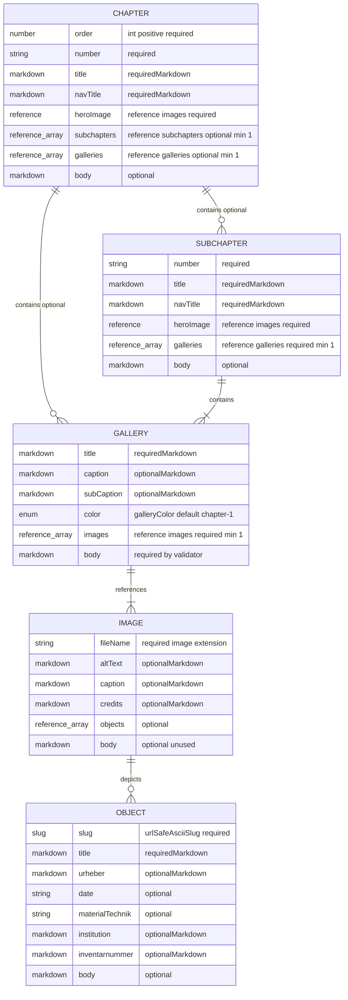

# Inhaltsmodell

Dieses Dokument beschreibt die Astro-Sammlungen aus `src/content.config.ts`.

## Kurzüberblick

| Bereich | Kurzbeschreibung |
|---|---|
| Kapitel | Ein Kapitel beschreibt einen großen Ausstellungsabschnitt und enthält entweder Unterkapitel oder direkt Galerien. |
| Unterkapitel | Ein Unterkapitel beschreibt einen kleineren Abschnitt innerhalb eines Kapitels und enthält die zugehörigen Galerien. |
| Galerie | Eine Galerie verbindet ein oder mehrere Bilder mit Bildunterschriftsdaten und einem begleitenden Markdown-Text. |
| Bild | Ein Bild beschreibt die Bilddatei, Alternativtext, Bildunterschriften und optional die darauf gezeigten Objekte. |
| Objekt | Ein Objekt beschreibt ein einzelnes Ausstellungsobjekt mit Titel, Urheber, Datierung, Institution und weiteren Metadaten. |

## Feldtypen

| Typ | Bedeutung |
|---|---|
| String | Ein kurzer Textwert im Frontmatter, meistens in Anführungszeichen, zum Beispiel `"Der Dichter"`. |
| Einfacher String | Ein String, der als reiner Datenwert behandelt wird, nicht als Markdown. Formatierungen wie `*kursiv*` werden hier nicht als Gestaltung interpretiert. |
| Markdown-String | Ein String, der Inline-Markdown enthalten darf, zum Beispiel `"Der *Dichter*"`. |
| Body-Markdown | Langer Markdown-Inhalt unterhalb des Frontmatter-Blocks. Hier stehen zum Beispiel Fließtexte, Absätze und Blockzitate. |
| Ganzzahl | Eine Zahl ohne Nachkommastellen, zum Beispiel `1`, `2` oder `3`. |
| Positive Ganzzahl | Eine Ganzzahl größer als `0`. |
| Boolean | Ein Wahr/Falsch-Wert: entweder `true` oder `false`. Dieser Typ wird aktuell nicht verwendet, ist aber für Schalter geeignet. |
| Array | Eine Liste mehrerer Werte, meistens als YAML-Liste geschrieben. Die Reihenfolge ist relevant, wenn das Feld so beschrieben ist. |
| Referenz | Verweis auf einen anderen Content-Eintrag, angegeben über dessen ID, zum Beispiel `"carfunkel-kupfer"`. |
| Array von Referenzen | Eine Liste von Verweisen auf andere Content-Einträge, zum Beispiel mehrere Bilder in einer Galerie. |
| Enum | Ein String, bei dem nur bestimmte Werte erlaubt sind, zum Beispiel `chapter-1` bis `chapter-7`. |
| URL-sicherer ASCII-Slug | Ein String für URLs. Erlaubt sind nur `A-Z`, `a-z`, `0-9`, `-`. Keine Leerzeichen, keine Steuerzeichen, keine Nicht-ASCII-Zeichen und keine URL-Sonderzeichen wie `~`, `/`, `\\`, `:`, `?`, `#`, `&` oder `=`. |

## Gemeinsame Abschnittsfelder

`chapters` und `subchapters` verwenden diese Felder gemeinsam.

Kurzbeschreibung: Diese Felder speichern die gemeinsamen Informationen für Kapitel und Unterkapitel, also Nummer, Titel, Navigationstitel und Hero-Bild.

| Feld | Typ | Pflicht | Hinweise |
|---|---|---:|---|
| `number` | Einfacher String | ja | Sichtbare Nummer, zum Beispiel `"01"` oder `"01.1"`. |
| `title` | Markdown-String | ja | Sichtbarer Titel. Unterstützt Inline-Markdown. |
| `navTitle` | Markdown-String | ja | Titel für die Navigation. Das Schema erlaubt Inline-Markdown, der Text sollte aber meist einfach bleiben. |
| `heroImage` | Referenz auf `images` | ja | ID des Hero-Bild-Eintrags. |
| Inhalt | Body-Markdown | nein | Freier Markdown-Text unterhalb des Frontmatters. |

## Sammlungen

Die folgenden Abschnitte beschreiben die Content-Sammlungen, aus denen die Ausstellungsdaten aufgebaut sind.

### Sammlung: `chapters`

Ein Kapitel ist ein großer Ausstellungsabschnitt und enthält entweder Unterkapitel oder direkt Galerien.

Pfad: `src/content/chapters/*.md`

| Feld | Typ | Pflicht | Hinweise |
|---|---|---:|---|
| `order` | Positive Ganzzahl | ja | Sortierreihenfolge der Kapitel. |
| `number` | Einfacher String | ja | Siehe gemeinsame Abschnittsfelder. |
| `title` | Markdown-String | ja | Siehe gemeinsame Abschnittsfelder. |
| `navTitle` | Markdown-String | ja | Siehe gemeinsame Abschnittsfelder. |
| `heroImage` | Referenz auf `images` | ja | Siehe gemeinsame Abschnittsfelder. |
| `subchapters` | Array von Referenzen auf `subchapters` | bedingt | Mindestens 1 Eintrag, wenn gesetzt. |
| `galleries` | Array von Referenzen auf `galleries` | bedingt | Mindestens 1 Eintrag, wenn gesetzt. |
| Inhalt | Body-Markdown | nein | Kapiteltext unterhalb des Frontmatters. |

Validierungsregel: Ein Kapitel muss entweder `subchapters` oder `galleries` definieren, aber nicht beides.

Beispiel:

```yaml
---
order: 1
number: "01"
title: "Der *Dichter*"
navTitle: "Der Dichter"
heroImage: "ag-1803-title"
subchapters:
  - "allemannische-gedichte"
---
```

### Sammlung: `subchapters`

Ein Unterkapitel ist ein Abschnitt innerhalb eines Kapitels und enthält direkt seine Galerien.

Pfad: `src/content/subchapters/*.md`

| Feld | Typ | Pflicht | Hinweise |
|---|---|---:|---|
| `number` | Einfacher String | ja | Siehe gemeinsame Abschnittsfelder. |
| `title` | Markdown-String | ja | Siehe gemeinsame Abschnittsfelder. |
| `navTitle` | Markdown-String | ja | Siehe gemeinsame Abschnittsfelder. |
| `heroImage` | Referenz auf `images` | ja | Siehe gemeinsame Abschnittsfelder. |
| `galleries` | Array von Referenzen auf `galleries` | ja | Mindestens 1 Galerie. |
| Inhalt | Body-Markdown | nein | Unterkapiteltext unterhalb des Frontmatters. |

Beispiel:

```yaml
---
number: "01.1"
title: "Die *Allemannischen Gedichte*"
navTitle: "Allemannische Gedichte"
heroImage: "tschopli-hero"
galleries:
  - "allemannische-gedichte-im-bild"
---
```

### Sammlung: `galleries`

Eine Galerie verbindet Bilder, Bildunterschriften, Farbe und begleitenden Markdown-Text zu einem Galeriebaustein.

Pfad: `src/content/galleries/*.md`

| Feld | Typ | Pflicht | Hinweise |
|---|---|---:|---|
| `title` | Markdown-String | ja | Galerietitel. Unterstützt Inline-Markdown. |
| `caption` | Markdown-String | nein | Galerie-weite Ersatz-Bildunterschrift. |
| `subCaption` | Markdown-String | nein | Galerie-weiter Zusatz zur Ersatz-Bildunterschrift. |
| `color` | Enum | nein | Standardwert ist `chapter-1`. Erlaubt sind `chapter-1` bis `chapter-7`. |
| `images` | Array von Referenzen auf `images` | ja | Mindestens 1 Bild. |
| Inhalt | Body-Markdown | ja | Essay-Text unterhalb der Galerie. Blockzitate können direkt hier geschrieben werden. |

Blockzitat-Konvention im Body-Markdown:

```md
> Der Zitattext kann einen oder mehrere Absätze enthalten.
>
> — JPH
>
> Quellen- oder Zusatzzeile
```

Der letzte Absatz wird als Quelle interpretiert, der vorletzte Absatz als Autor, und alle vorherigen Absätze als Zitattext.

Beispiel:

```yaml
---
title: "Der *Karfunkel* als Bildfolge"
caption: "Bildzeugnisse zur Wirkungsgeschichte"
subCaption: "Diese Galerie nutzt Objekt-, Bild- und Galerie-Metadaten als Ersatzwerte für Bildunterschriften."
color: "chapter-1"
images:
  - "carfunkel-kupfer"
  - "carfunkel-nisle"
  - "carfunkel-richter"
---
```

### Sammlung: `images`

Ein Bild beschreibt eine Bilddatei mit Alternativtext, Bildunterschrift, Bildnachweis und optionalen Objektverweisen.

Pfad: `src/content/images/*.md`

| Feld | Typ | Pflicht | Hinweise |
|---|---|---:|---|
| `fileName` | Einfacher String | ja | Dateiname des Assets. Muss auf `.avif`, `.gif`, `.jpg`, `.jpeg`, `.png` oder `.webp` enden. |
| `altText` | Markdown-String | nein | Alternativtext. Das Schema erlaubt Markdown, aus Barrierefreiheitsgründen sollte der Text aber einfach bleiben. |
| `caption` | Markdown-String | nein | Bild-spezifische Bildunterschrift. |
| `credits` | Markdown-String | nein | Bildnachweis. |
| `objects` | Array von Referenzen auf `objects` | nein | Objekte, die auf diesem Bild gezeigt werden. |
| Inhalt | Body-Markdown | nein | Wird aktuell nicht für die Galerie-Darstellung genutzt. |

Beispiel:

```yaml
---
fileName: "2.2_01_Zix_Carfunkel_Kupfer_1806_TSS.webp"
altText: "Kupferstich zu Der Karfunkel"
caption: "Der Karfunkel"
credits: "Theodor Springmann Stiftung"
objects:
  - "zix-carfunkel-1806"
---
```

### Sammlung: `objects`

Ein Objekt beschreibt ein einzelnes Ausstellungsobjekt mit seinen kuratorischen Metadaten.

Pfad: `src/content/objects/*.md`

| Feld | Typ | Pflicht | Hinweise |
|---|---|---:|---|
| `slug` | URL-sicherer ASCII-Slug | ja | Öffentlicher Objekt-Slug. |
| `title` | Markdown-String | ja | Objekttitel. Unterstützt Inline-Markdown. |
| `urheber` | Markdown-String | nein | Urheber oder Autor. |
| `date` | Einfacher String | nein | Datum oder Datierung. Darf nicht leer sein, wenn gesetzt. |
| `materialTechnik` | Einfacher String | nein | Material und Technik. Darf nicht leer sein, wenn gesetzt. |
| `institution` | Markdown-String | nein | Bewahrende Institution. |
| `inventarnummer` | Markdown-String | nein | Inventarnummer. |
| Inhalt | Body-Markdown | nein | Objektbeschreibung unterhalb des Frontmatters. |

Beispiel:

```yaml
---
slug: "zix-carfunkel-1806"
title: "Der Karfunkel"
urheber: "Benjamin Zix"
date: "1806"
materialTechnik: "Kupferstich"
institution: "Theodor Springmann Stiftung"
inventarnummer: "Beispiel-Inventarnummer"
---
```

## Bildunterschrift-Ersatzlogik

Galerie-Bildunterschriften werden von den spezifischsten zu den allgemeinsten Daten aufgelöst:

Kurzbeschreibung: Die sichtbaren Bildunterschriften kommen zuerst aus Objekt-Daten, dann aus Bild-Daten und zuletzt aus Galerie-Daten.

| Priorität | Quelle | Hinweise |
|---:|---|---|
| 1 | Metadaten aus `objects` | Wird genutzt, wenn ein Bild ein oder mehrere Objekte referenziert. |
| 2 | `images.caption` und `images.credits` | Wird genutzt, wenn Bildmetadaten vorhanden sind, aber keine Objektmetadaten. |
| 3 | `galleries.caption` und `galleries.subCaption` | Galerie-weiter Ersatzwert. |

## Grafik


