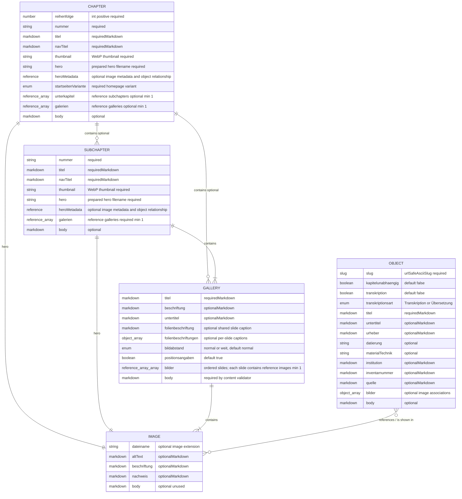

# Inhaltsmodell

Dieses Dokument beschreibt die Astro-Sammlungen aus `src/content.config.ts`.

## Kurzüberblick

| Bereich | Kurzbeschreibung |
|---|---|
| Kapitel | Ein Kapitel beschreibt einen großen Ausstellungsabschnitt und enthält entweder Unterkapitel oder direkt Galerien. |
| Unterkapitel | Ein Unterkapitel beschreibt einen kleineren Abschnitt innerhalb eines Kapitels und enthält die zugehörigen Galerien. |
| Galerie | Eine Galerie verbindet eine geordnete Folge von Folien mit Bildunterschriftsdaten und einem begleitenden Markdown-Text. Jede Folie enthält ein oder mehrere Bilder. |
| Bild | Ein optionaler Bild-Metadatensatz beschreibt Dateiname, Alternativtext, Bildunterschrift und Nachweis. |
| Objekt | Ein Objekt beschreibt ein einzelnes Ausstellungsobjekt mit seinen Metadaten und verweist auf die Bilder, in denen es gezeigt wird. |

## Feldtypen

| Typ | Bedeutung |
|---|---|
| String | Ein kurzer Textwert im Frontmatter, meistens in Anführungszeichen, zum Beispiel `"Der Dichter"`. |
| Markdown-String | Ein String, der Inline-Markdown enthalten darf, zum Beispiel `"Der *Dichter*"`. |
| Body-Markdown | Langer Markdown-Inhalt unterhalb des Frontmatter-Blocks. Hier stehen zum Beispiel Fließtexte, Absätze und Blockzitate. |
| Ganzzahl | Eine Zahl ohne Nachkommastellen, zum Beispiel `1`, `2` oder `3`. |
| Boolean | Ein Wahr/Falsch-Wert: entweder `true` oder `false`. |
| Array | Eine Liste mehrerer Werte. Die Reihenfolge kann je nach Verwendung relevant sein. |
| Referenz | Verweis auf einen anderen Content-Eintrag, angegeben über dessen ID, zum Beispiel `"carfunkel-kupfer"`. |
| Array von Referenzen | Eine Liste von Referenzen, zum Beispiel mehrere Bilder in einer Galerie. |
| Array von Referenz-Arrays | Eine geordnete Liste von Gruppen. Bei `galleries.bilder` ist jede äußere Gruppe eine Folie und jedes innere Element ein Bild auf dieser Folie. |
| Enum | Ein String, bei dem nur bestimmte Werte erlaubt sind, zum Beispiel beim Bildabstand nur `normal` oder `weit`. |
| URL-sicherer ASCII-Slug | Ein String für URLs. Erlaubt sind nur `A-Z`, `a-z`, `0-9` und `-`. Keine Leerzeichen, Unterstriche, Steuerzeichen, Nicht-ASCII-Zeichen oder URL-Sonderzeichen. Objekt-Slugs dürfen außerdem nicht mit einer Kapitelnummer von `1-` bis `7-` beginnen. |

## Sammlungen

Die folgenden Abschnitte beschreiben die Content-Sammlungen, aus denen die Ausstellungsdaten aufgebaut sind.

### Sammlung: `chapters`

Ein Kapitel ist ein großer Ausstellungsabschnitt und enthält entweder Unterkapitel oder direkt Galerien.

Pfad: `src/content/chapters/*.md`

| Feld | Typ | Pflicht | Hinweise |
|---|---|---:|---|
| `reihenfolge` | Positive Ganzzahl | ja | Sortierreihenfolge der Kapitel. |
| `nummer` | String | ja | Sichtbare Kapitelnummer, zum Beispiel `"1"` oder `"2"`. |
| `titel` | Markdown-String | ja | Sichtbarer Kapiteltitel. Unterstützt Inline-Markdown. |
| `navTitel` | Markdown-String | ja | Titel für Navigationen und Menüs. Das Schema erlaubt Inline-Markdown, der Text sollte aber meist einfach bleiben. |
| `thumbnail` | String | ja | Dateiname eines WebP-Bildes in `src/assets/Thumbnails`. Das Bild wird in der Kapitelübersicht und auf der Startseite verwendet. |
| `hero` | String | ja | Dateiname des vorbereiteten Kapitel-Heroes in `src/assets/Heroes`. |
| `heroMetadata` | Bildreferenz | nein | Bilddatensatz des zugrunde liegenden Objekts für Alternativtext, Beschriftung und Objektlink. |
| `startseitenVariante` | Enum | ja | Darstellungsvariante auf der Startseite. Erlaubt sind `featured`, `poet`, `friend`, `theologian`, `proteuser`, `bachelor` und `letter-writer`. |
| `unterkapitel` | Array von Referenzen auf `subchapters` | bedingt | Mindestens 1 Eintrag, wenn gesetzt. |
| `galerien` | Array von Referenzen auf `galleries` | bedingt | Mindestens 1 Eintrag, wenn gesetzt. |
| Inhalt | Body-Markdown | nein | Kapiteltext unterhalb des Frontmatters. |

Validierungsregel: Ein Kapitel muss entweder `unterkapitel` oder `galerien` definieren, aber nicht beides.

Beispiel mit Unterkapiteln:

```md
---
reihenfolge: 2
nummer: "2"
titel: "Der Dichter"
navTitel: "Der Dichter"
thumbnail: "2.webp"
hero: "2.webp"
heroMetadata: "20_hero_image_tschoepli_tss"
startseitenVariante: "poet"
unterkapitel:
  - "2-1-allemannische-gedichte-1803"
  - "2-2-allemannische-gedichte-im-bild"
  - "2-3-uebersetzungen"
  - "2-4-raubdrucke"
---

Jenseits des deutschsprachigen Südwestens sind sie heute weitgehend unbekannt – anders als früher. 1803 begründeten die anonym erschienenen *Allemannischen Gedichte* schlagartig das Renommée ihres Autors. Hebel hatte zur rechten Zeit den rechten Ton getroffen: Die Sammlung wurde mehrfach übersetzt, teilweise vertont, wiederholt bebildert, sie sah zahlreiche rechtmäßige Ausgaben, fragwürdige Nachdrucke sowie gelehrte Editionen. Als eines der meistaufgelegten Werke des 19. Jahrhunderts waren die *Allemannischen Gedichte* Teil des deutschliterarischen Kanons.

> Daß das Allemänlein in seinem luftigen rothen Tschöplein von seinen Landsleuten so gerne erkannt und so gut aufgenommen ist, und mit seinen Gauckeleyen noch da und dort ein Lächeln gewinnt, freut mich für das Allemänlein, und freut mich an den Landsleuten.
>
> — JPH, Z 90
```

Beispiel mit direkt enthaltenen Galerien:

```md
---
reihenfolge: 1
nummer: "1"
titel: "Der Oberländer"
navTitel: "Der Oberländer"
thumbnail: "1.webp"
hero: "1.webp"
heroMetadata: "1_00_01_hero_image_wiesental_blb"
startseitenVariante: "featured"
galerien:
  - "1-01-basel"
  - "1-02-hausen"
  - "1-03-schopfheim"
  - "1-04-roettler-schloss"
---

Wenn es vom *Rheinländischen Hausfreund* im Jahrgang 1809 heißt, er gehe fleißig am Rheinstrom auf und ab, dann deckt sich das recht genau mit dem Raum, in dem sich auch Hebels Leben abspielte. Sieht man von seiner Studienzeit in Erlangen ab, gelangte Hebel auch da, wo er das zwischen Basel und Mannheim sich erstreckende Großherzogtum Baden verließ, nur in die nächste Nachbarschaft (Straßburg, Stuttgart, Schweiz). Das erste Kapitel stellt die wichtigsten Stationen in Hebels Leben vor.
```

### Sammlung: `subchapters`

Ein Unterkapitel ist ein Abschnitt innerhalb eines Kapitels und enthält direkt seine Galerien.

Pfad: `src/content/subchapters/*.md`

| Feld | Typ | Pflicht | Hinweise |
|---|---|---:|---|
| `nummer` | String | ja | Sichtbare Unterkapitelnummer, zum Beispiel `"02.1"`. |
| `titel` | Markdown-String | ja | Sichtbarer Unterkapiteltitel. Unterstützt Inline-Markdown. |
| `navTitel` | Markdown-String | ja | Titel für Navigationen und Menüs. Das Schema erlaubt Inline-Markdown, der Text sollte aber meist einfach bleiben. |
| `thumbnail` | String | ja | Dateiname des vorbereiteten Unterkapitel-Thumbnails in `src/assets/Thumbnails`. |
| `hero` | String | ja | Dateiname des vorbereiteten Unterkapitel-Heroes in `src/assets/Heroes`. |
| `heroMetadata` | Bildreferenz | nein | Bilddatensatz des zugrunde liegenden Objekts für Alternativtext, Beschriftung und Objektlink. |
| `galerien` | Array von Referenzen auf `galleries` | ja | Mindestens 1 Galerie. |
| Inhalt | Body-Markdown | nein | Unterkapiteltext unterhalb des Frontmatters. |

Beispiel:

```md
---
nummer: "02.1"
titel: "Die *Allemannischen Gedichte* von 1803"
navTitel: "Die Allemannischen Gedichte von 1803"
thumbnail: "2-1.webp"
hero: "2-1.webp"
heroMetadata: "hans-und-verene-hero"
galerien:
  - "ueberraschungserfolg-eines-literarischen-debuetanten"
  - "christlich-romantische-volkspoesie"
  - "volkspoesie-im-harmlosen-biedermeier"
  - "hans-und-verene-reinhard-1820"
---

Anonym erschienen, begründeten sie sein literarisches Renommée: Mit den *Allemannischen Gedichten* traf Hebel am rechten Ort zur rechten Zeit den richtigen Ton.
```

### Sammlung: `galleries`

Eine Galerie verbindet Bilder, Bildunterschriften und begleitenden Markdown-Text zu einem Galeriebaustein. Die Galeriefläche verwendet die Farbe des zugehörigen Kapitels; Bilder werden darauf ohne zusätzliches Passepartout dargestellt.

Pfad: `src/content/galleries/*.md`

| Feld | Typ | Pflicht | Hinweise |
|---|---|---:|---|
| `titel` | Markdown-String | ja | Galerietitel. Unterstützt Inline-Markdown. |
| `beschriftung` | Markdown-String | nein | Galerie-weite Ersatz-Bildunterschrift. |
| `untertitel` | Markdown-String | nein | Galerie-weiter Zusatz zur Ersatz-Bildunterschrift. Der aktuelle Renderer zeigt ihn nur im Text-Ersatz an, wenn kein Galeriebild aufgelöst werden konnte. |
| `folienbeschriftung` | Markdown-String | nein | Gemeinsame Hauptbeschriftung für alle Folien. Eine folienspezifische Beschriftung hat Vorrang. |
| `folienbeschriftungen` | Array von Folienbeschriftungen | nein | Folienspezifische Haupt- und Unterbeschriftungen. Standardwert ist eine leere Liste. Die Struktur wird unten beschrieben. |
| `bildabstand` | Enum | nein | Abstand zwischen mehreren Bildern einer Folie: `normal` oder `weit`. Standardwert ist `normal`. |
| `positionsangaben` | Boolean | nein | Vorgesehener Schalter für automatische Angaben wie „Links“ und „Rechts“. Standardwert ist `true`; der aktuelle Renderer wertet den Schalter noch nicht aus. |
| `bilder` | Array von Bildreferenz-Arrays | ja | Mindestens 1 Folie mit mindestens 1 Bild. Das äußere Array bestimmt die Folienreihenfolge; die inneren Arrays bestimmen die Reihenfolge der nebeneinander dargestellten Bilder. Jede Referenz ist eine Bild-Metadaten-ID oder ein vollständiger `Bilder/...`-Pfad einschließlich Dateiendung. |
| Inhalt | Body-Markdown | ja | Essay-Text unterhalb der Galerie. Der zusätzliche Inhaltsvalidator verlangt mindestens einen nicht leeren Text. Blockzitate können direkt hier geschrieben werden. |

Eine Folienbeschriftung in `folienbeschriftungen` hat folgende Felder:

| Feld | Typ | Pflicht | Hinweise |
|---|---|---:|---|
| `folie` | Positive Ganzzahl | ja | Einsbasierte Nummer der Folie, für die die Beschriftung gilt. |
| `beschriftung` | Markdown-String | ja | Gemeinsame Hauptbeschriftung der Folie. |
| `unterbeschriftungen` | Array | nein | Geordnete Zusatztexte. Ein Eintrag ist entweder ein Markdown-String oder ein Objekt mit `bild` (einsbasierte Bildnummer) und `beschriftung`. Standardwert ist eine leere Liste. Diese Daten bleiben im Content erhalten, werden auf der Ausstellungsseite derzeit aber nicht ausgegeben. |

Blockzitat-Konvention im Body-Markdown:

```md
> Der Zitattext kann einen oder mehrere Absätze enthalten.
>
> — JPH
>
> Quellen- oder Zusatzzeile
```

Der letzte Absatz wird als Quelle interpretiert, der vorletzte Absatz als Autor, und alle vorherigen Absätze als Zitattext.

Beispiel:

```md
---
titel: "Überraschungserfolg eines literarischen Debütanten"
folienbeschriftungen:
  - folie: 1
    beschriftung: "Die erste Auflage der *Allemannischen Gedichte* und Goethes Rezension"
    unterbeschriftungen:
      - bild: 1
        beschriftung: "Titelblatt der Erstausgabe"
bilder:
  - - "Bilder/2-1/2.1_01_1_AG_1803_und_ALZ_TSS.webp"
    - "2.1_01_02_Goethe_ALZ_01"
---

Die *Allemannischen Gedichte*, von denen rasch eine weitere Auflage auf den Markt kam, waren umgehend nicht nur regional erfolgreich; mit seinem literarischen Debüt war Hebel „im Begriff sich einen eigenen Platz auf dem deutschen Parnaß zu erwerben“ (Goethe).

Beifall fand die Sammlung als kunstfertig inszenierte naive Dichtung: in der Tradition von Matthias Claudius’ *Wandsbecker Bothen* bzw. einer sich mündlich gebenden Volkspoesie, wie sie seit Herders *Volksliedern* geschätzt wurde.

> Es ist für mich wahr und bleibt für mich wahr, der Himmel ist nirgends so blau, und die Luft nirgends so rein, und alles so lieblich und so heimlich als zwischen den Bergen von Hausen [...]
>
> — JPH, Z 54
>
> Brief an Johann Jeremias Herbster, 14. Dezember 1800
```

Beispiel für eine Folie mit zwei Bildern und eine weitere Folie mit einem Bild:

```yaml
bilder:
  - - "brief-vorderseite"
    - "brief-rueckseite"
  - - "brief-detail"
```

### Sammlung: `images`

Ein Bild-Metadatensatz beschreibt optional eine Bilddatei mit Alternativtext, Bildunterschrift und Bildnachweis. Objektverweise werden ausschließlich in der Sammlung `objects` gespeichert.

Pfad: `src/content/images/*.md`

| Feld | Typ | Pflicht | Hinweise |
|---|---|---:|---|
| `dateiname` | String | nein | Pfad relativ zu `src/assets`, in der Regel `Bilder/<Kapitel oder Unterkapitel>/<Dateiname>`. |
| `altText` | Markdown-String | nein | Alternativtext. Das Schema erlaubt Markdown, aus Barrierefreiheitsgründen sollte der Text aber einfach bleiben. |
| `beschriftung` | Markdown-String | nein | Bild-spezifische Bildunterschrift. |
| `nachweis` | Markdown-String | nein | Bildnachweis. |
| Inhalt | Body-Markdown | nein | Wird aktuell nicht für die Galerie-Darstellung genutzt. |

Beispiel:

```yaml
---
dateiname: "Bilder/2-2/2.2_01_Zix_Carfunkel_Kupfer_1806_TSS.webp"
altText: "Dritte Auflage der Allemannischen Gedichte mit Titelkupfer von Benjamin Zix"
beschriftung: "Dritte Auflage der Allemannischen Gedichte mit einem Titelkupfer von Benjamin Zix"
nachweis: "Hebel-Archiv Heidelberg"
---
```

Bild-Metadatensätze enthalten keine Objektbeziehungen. Die Verknüpfung wird ausschließlich vom Objekt aus über `objects.bilder` definiert.

### Sammlung: `objects`

Ein Objekt beschreibt ein einzelnes Ausstellungsobjekt mit seinen kuratorischen Metadaten.

Pfad: `src/content/objects/*.md`

| Feld | Typ | Pflicht | Hinweise |
|---|---|---:|---|
| `slug` | URL-sicherer ASCII-Slug | ja | Öffentlicher Objekt-Slug. |
| `kapitelunabhaengig` | Boolean | nein | Wenn `true`, erhält die Objektseite keinen Rücksprungkontext zu einem Kapitel oder Unterkapitel. Standardwert ist `false`. |
| `transkription` | Boolean | nein | Gibt an, ob der Body eine Transkription enthält. Standardwert ist `false`. |
| `transkriptionsart` | Enum | nein | Bezeichnung des Langtexts und des Galerie-Links: `Transkription` oder `Übersetzung`. Standardwert ist `Transkription`. |
| `titel` | Markdown-String | ja | Objekttitel. Unterstützt Inline-Markdown. |
| `untertitel` | Markdown-String | nein | Objektuntertitel. Unterstützt Inline-Markdown. |
| `urheber` | Markdown-String | nein | Urheber oder Autor. |
| `datierung` | String | nein | Datum oder Datierung. Darf nicht leer sein, wenn gesetzt. |
| `materialTechnik` | String | nein | Material und Technik. Darf nicht leer sein, wenn gesetzt. |
| `institution` | Markdown-String | nein | Bewahrende Institution. |
| `inventarnummer` | Markdown-String | nein | Inventarnummer. |
| `quelle` | Markdown-String | nein | Quelle oder Quellenangabe zum Objekt. |
| `bilder` | Array von Bildzuordnungen | nein | Geordnete Bilder des Objekts. Jede Zuordnung enthält `bild` und optional `position`, `objektReihenfolge`, `beschriftung` sowie `inObjektansicht`. |
| Inhalt | Body-Markdown | nein | Objektbeschreibung, Transkription oder Übersetzung unterhalb des Frontmatters. Jeder vorhandene Inhalt muss unter einer der Überschriften `# Beschreibung`, `# Transkription` oder `# Übersetzung` stehen. Andere H1-Überschriften und Text vor der ersten H1-Überschrift sind nicht erlaubt. |

Eine Bildzuordnung hat folgende Felder:

| Feld | Typ | Pflicht | Hinweise |
|---|---|---:|---|
| `bild` | Bild-ID oder Asset-Pfad | ja | ID eines optionalen Eintrags in `src/content/images`, der auf ein `Bilder/...`-Asset verweist, oder vollständiger Pfad relativ zu `src/assets`, zum Beispiel `Bilder/2-2/datei.webp`. |
| `position` | Enum | nein | Position dieses Objekts in genau diesem Bild: `Links`, `Rechts` oder `Vorne`. |
| `objektReihenfolge` | Positive Ganzzahl | nein | Reihenfolge mehrerer Objekte innerhalb desselben Bildes. Nur bei Bildern mit mehreren Objekten erforderlich. |
| `beschriftung` | Markdown-String | nein | Bildunterschrift dieses Objekts in der Galerie. Überschreibt dort den Objekttitel. |
| `inObjektansicht` | Boolean | nein | Bestimmt, ob das Bild auf der Objektseite erscheint. Die Beziehung des Objekts zum Galeriebild bleibt auch bei `false` bestehen. Standardwert ist `true`. |

Beispiel:

```md
---
slug: "zix-carfunkel-1806"
transkription: false
titel: "Dritte Auflage der *Allemannischen Gedichte* mit einem Titelkupfer von Benjamin Zix"
urheber: |-
  Benjamin Zix (Künstler)
  Johann Peter Hebel (Autor)
datierung: "1806"
materialTechnik: "Kupferstich"
institution: "Hebel-Archiv Heidelberg"
inventarnummer: "412284"
quelle: "https://example.com/object/412284"
bilder:
  - bild: "Bilder/2-2/2.2_01_Zix_Carfunkel_Kupfer_1806_TSS.webp"
---

# Beschreibung

Die dritte Auflage der *Allemannischen Gedichte* zeigt auf dem Titelkupfer von Benjamin Zix, wie Hebels alemannische Gedichte schon früh durch Bilder gelesen und gedeutet wurden.
```

## Bildunterschrift-Ersatzlogik

Eine passende `folienbeschriftungen`-Hauptbeschriftung hat Vorrang vor `folienbeschriftung`. Bei genau einem Objekt auf einer Folie wird der Objektlink an dieser gemeinsamen Beschriftung ausgegeben. Ohne gemeinsame Folienbeschriftung verwendet ein Bild mit genau einem Objekt zuerst `images.beschriftung`, danach die optionale `beschriftung` der Objekt-Bild-Zuordnung und zuletzt den Objekttitel.

Bei mehreren unterschiedlichen Objekten wird für jedes Objekt zuerst die `beschriftung` seiner Bildzuordnung und danach sein Objekttitel verwendet. Jedes eindeutige Objekt erhält einen eigenen Link. Bei mehreren Bildern oder Objekten ergänzt der Renderer nötigenfalls automatisch Positionsangaben wie „Links“, „Mitte“ oder „Rechts“. Enthält ein Bild keine Objektbeziehung, dient `images.beschriftung` als Bildunterschrift. Erst wenn keine dieser Beschriftungen vorhanden ist, wird die Galerie-weite `beschriftung` verwendet.

Die Einträge aus `folienbeschriftungen[].unterbeschriftungen` und der Galerie-`untertitel` werden in einer regulären Galerie derzeit nicht ausgegeben. Die Daten bleiben für eine spätere Verwendung im Content erhalten.

## Bilddatei-Ersatzlogik

Bild-Metadaten in `src/content/images` sind optional. Galerien und `objects.bilder` dürfen entweder eine Bild-Metadaten-ID oder direkt einen vollständigen Pfad relativ zu `src/assets` verwenden. Beide Referenzformen müssen auf ein Asset unter `Bilder/<Kapitel oder Unterkapitel>/` auflösen. Unterstützt werden `.avif`, `.gif`, `.jpg`, `.jpeg`, `.png` und `.webp`.

Wenn ein gleichnamiger Bild-Eintrag vorhanden ist, werden dessen `dateiname`, Alternativtext, Beschriftung und Nachweis verwendet. Ohne Bild-Eintrag wird das Asset direkt geladen und die allgemeineren Metadaten des jeweiligen Kontexts dienen als Ersatz. Objektbeziehungen werden unabhängig davon über `objects.bilder` anhand des aufgelösten Assets ermittelt.

### Bildidentität

Für Galerien und `objects.bilder` gelten zwei Referenzformen:

- ID einer Datei in `src/content/images`, ohne `.md`
- vollständiger Asset-Pfad relativ zu `src/assets`, zum Beispiel `Bilder/2-1/datei.webp`

Entscheidend für die Identität ist immer die aufgelöste Datei unter `src/assets`, nicht der geschriebene Referenzwert. Verweist zum Beispiel eine Galerie über eine Bild-Metadaten-ID auf ein Asset und ein Objekt direkt über dessen `Bilder/...`-Pfad auf dasselbe Asset, werden beide als dasselbe Bild behandelt. Das Objekt wird deshalb an diesem Galerie-Bild angezeigt.

## Grafik


```mermaid
erDiagram
  CHAPTER ||--o{ SUBCHAPTER : "contains optional"
  CHAPTER ||--o{ GALLERY : "contains optional"
  CHAPTER ||--|| IMAGE : "hero"
  SUBCHAPTER ||--|{ GALLERY : "contains"
  SUBCHAPTER ||--|| IMAGE : "hero"
  GALLERY ||--|{ IMAGE : "contains"
  OBJECT }o--o{ IMAGE : "references / is shown in"

  CHAPTER {
    number reihenfolge "int positive required"
    string nummer "required"
    markdown titel "requiredMarkdown"
    markdown navTitel "requiredMarkdown"
    string thumbnail "WebP thumbnail required"
    string hero "prepared hero filename required"
    reference heroMetadata "optional image metadata and object relationship"
    enum startseitenVariante "required homepage variant"
    reference_array unterkapitel "reference subchapters optional min 1"
    reference_array galerien "reference galleries optional min 1"
    markdown body "optional"
  }

  SUBCHAPTER {
    string nummer "required"
    markdown titel "requiredMarkdown"
    markdown navTitel "requiredMarkdown"
    string thumbnail "WebP thumbnail required"
    string hero "prepared hero filename required"
    reference heroMetadata "optional image metadata and object relationship"
    reference_array galerien "reference galleries required min 1"
    markdown body "optional"
  }

  GALLERY {
    markdown titel "requiredMarkdown"
    markdown beschriftung "optionalMarkdown"
    markdown untertitel "optionalMarkdown"
    markdown folienbeschriftung "optional shared slide caption"
    object_array folienbeschriftungen "optional per-slide captions"
    enum bildabstand "normal or weit, default normal"
    boolean positionsangaben "default true"
    reference_array_array bilder "ordered slides; each slide contains reference images min 1"
    markdown body "required by content validator"
  }

  IMAGE {
    string dateiname "optional image extension"
    markdown altText "optionalMarkdown"
    markdown beschriftung "optionalMarkdown"
    markdown nachweis "optionalMarkdown"
    markdown body "optional unused"
  }

  OBJECT {
    slug slug "urlSafeAsciiSlug required"
    boolean kapitelunabhaengig "default false"
    boolean transkription "default false"
    enum transkriptionsart "Transkription or Übersetzung"
    markdown titel "requiredMarkdown"
    markdown untertitel "optionalMarkdown"
    markdown urheber "optionalMarkdown"
    string datierung "optional"
    string materialTechnik "optional"
    markdown institution "optionalMarkdown"
    markdown inventarnummer "optionalMarkdown"
    markdown quelle "optionalMarkdown"
    object_array bilder "optional image associations"
    markdown body "optional"
  }
```
