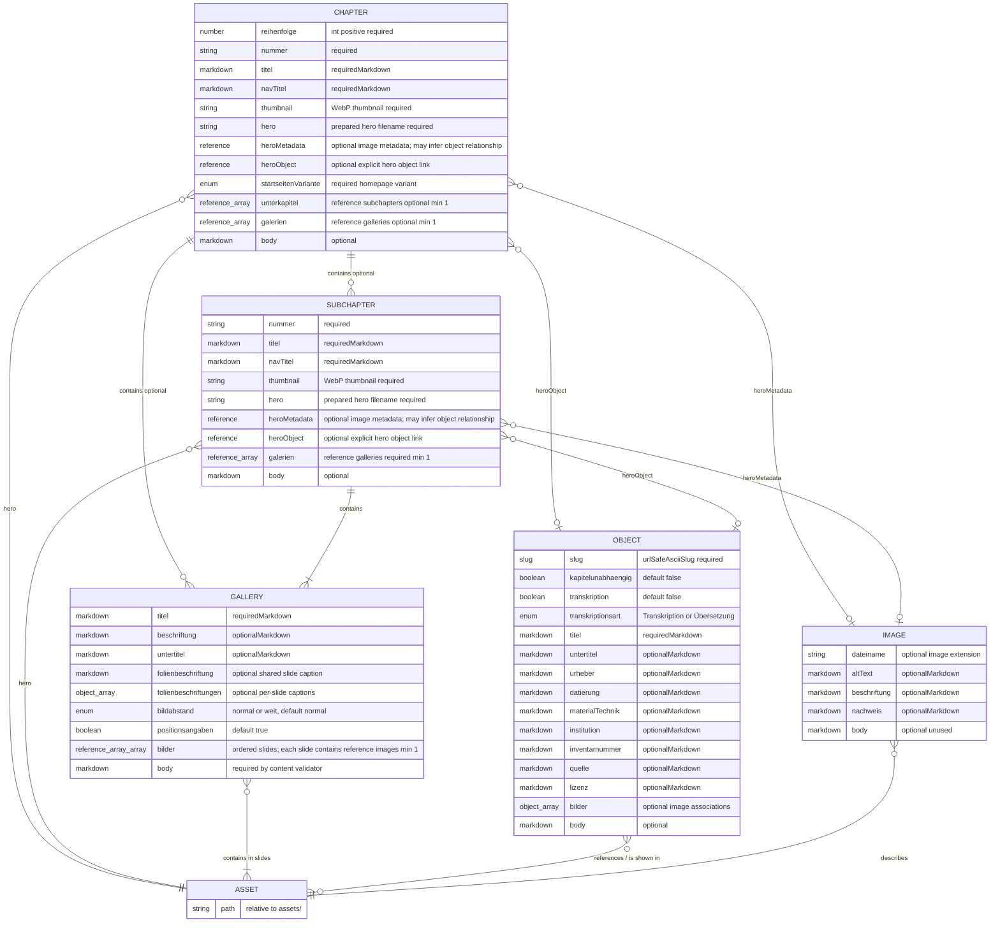

# Inhaltsmodell

Alle Projektpfade in diesem Dokument sind relativ zum Repository-Stammverzeichnis.

Dieses Dokument beschreibt die Astro-Sammlungen aus [`app/src/content.config.ts`](../app/src/content.config.ts).

## Dateien bearbeiten und prüfen

Die redaktionellen Markdown-Dateien liegen im Stammordner `content/`, die Bilddateien in `assets/`. Anwendung, Schema und Hilfsskripte bleiben in `app/`. Die folgenden Befehle werden aus `app/` ausgeführt:

| Befehl | Zweck |
|---|---|
| `npm run dev` | Lokale Vorschau; Änderungen in `content/` und `assets/` werden beobachtet. |
| `npm run content:validate` | Prüft zusätzliche Inhaltsregeln, Bildverweise und Objektbeziehungen. |
| `npm run build` | Führt die Inhaltsprüfung aus, prüft das Astro-Schema und erzeugt die Website einschließlich der optimierten Bildvarianten. |
| `npm run licenses:generate` | Aktualisiert `app/LICENSES.csv` nach Änderungen an den Objekt- und Bildmetadaten. |

Für eine vollständige Prüfung vor der Veröffentlichung `npm run build` verwenden. `content:validate` allein ersetzt die Schema- und Build-Prüfung nicht. GitHub Pages führt den Build nach einem Push auf `main` aus.

Kapitel und Unterkapitel liegen direkt in `content/chapters/`. Galerien sind in Unterordnern wie `content/galleries/1/`, `2-1/` und `2-2/` organisiert; Loader und Inhaltsvalidator lesen sie rekursiv. Bildmetadaten und Objekte bleiben direkt in `content/images/` und `content/objects/`, da der zusätzliche Validator dort nur unmittelbar enthaltene Markdown-Dateien prüft.

## Kurzüberblick

| Bereich | Kurzbeschreibung |
|---|---|
| Kapitel | Ein Kapitel beschreibt einen großen Ausstellungsabschnitt und enthält entweder Unterkapitel oder direkt Galerien. |
| Unterkapitel | Ein Unterkapitel beschreibt einen kleineren Abschnitt innerhalb eines Kapitels und enthält die zugehörigen Galerien. |
| Galerie | Eine Galerie verbindet eine geordnete Folge von Folien mit Bildunterschriftsdaten und einem begleitenden Markdown-Text. Jede Folie enthält ein oder mehrere Bilder. |
| Bild | Ein optionaler Bild-Metadatensatz beschreibt Dateiname, Alternativtext, Bildunterschrift und Nachweis. |
| Objekt | Ein Objekt beschreibt ein einzelnes Ausstellungsobjekt mit seinen Metadaten und verweist auf die Bilder, in denen es gezeigt wird. |

## Feldtypen

| Typ | Bedeutung |
|---|---|
| String | Ein kurzer Textwert im Frontmatter, meistens in Anführungszeichen, zum Beispiel `"Der Dichter"`. |
| Markdown-String | Ein String, der Inline-Markdown enthalten darf, zum Beispiel `"Der *Dichter*"`. |
| Body-Markdown | Langer Markdown-Inhalt unterhalb des Frontmatter-Blocks. Hier stehen zum Beispiel Fließtexte, Absätze und Blockzitate. |
| Ganzzahl | Eine Zahl ohne Nachkommastellen, zum Beispiel `1`, `2` oder `3`. |
| Boolean | Ein Wahr/Falsch-Wert: entweder `true` oder `false`. |
| Array | Eine Liste mehrerer Werte. Die Reihenfolge kann je nach Verwendung relevant sein. |
| Referenz | Verweis auf einen anderen Content-Eintrag, angegeben über dessen ID, zum Beispiel `"carfunkel-kupfer"`. |
| Array von Referenzen | Eine Liste von Referenzen, zum Beispiel mehrere Bilder in einer Galerie. |
| Array von Referenz-Arrays | Eine geordnete Liste von Gruppen. Bei `galleries.bilder` ist jede äußere Gruppe eine Folie und jedes innere Element ein Bild auf dieser Folie. |
| Enum | Ein String, bei dem nur bestimmte Werte erlaubt sind, zum Beispiel beim Bildabstand nur `normal` oder `weit`. |
| URL-sicherer ASCII-Slug | Ein String für URLs. Erlaubt sind nur `A-Z`, `a-z`, `0-9` und `-`. Keine Leerzeichen, Unterstriche, Steuerzeichen, Nicht-ASCII-Zeichen oder URL-Sonderzeichen. Objekt-Slugs dürfen außerdem nicht mit einer Kapitelnummer von `1-` bis `7-` beginnen. |

Optionale Markdown-Felder müssen weggelassen werden, wenn sie nicht gebraucht werden. Ein vorhandener leerer String oder ein Wert nur aus Leerzeichen ist nicht erlaubt.

## IDs und Adressen

Objektdateien heißen immer `<slug>.md`; zum Beispiel gehören `content/objects/zix-carfunkel.md`, `slug: "zix-carfunkel"` und `/objekte/zix-carfunkel/` zusammen. Astro verwendet den Frontmatter-Slug als Objekt-ID; `heroObject` und direkte Objektabfragen verwenden denselben Wert. Der Inhaltsvalidator prüft, dass Dateiname und Slug übereinstimmen. Beim Ändern eines Slugs müssen deshalb auch die Datei und ihre Objektverweise angepasst werden; außerdem ändert sich die öffentliche Objektadresse.

Galerie-IDs entsprechen dem vollständigen Dateinamen ohne `.md`, unabhängig vom Unterordner. `content/galleries/2-1/2-1-01-ueberraschungserfolg.md` wird deshalb weiter als `2-1-01-ueberraschungserfolg` referenziert. Jeder Galerie-Dateiname muss über alle Unterordner hinweg eindeutig sein; doppelte IDs sind ein Validierungsfehler. Der Ordner dient der Organisation, die Zuordnung und Reihenfolge auf der Website werden durch `galerien` im Kapitel oder Unterkapitel bestimmt.

Bei Kapiteln, Unterkapiteln und Bildmetadaten normalisiert Astro die Datei-IDs. Die Bildauflösung akzeptiert zusätzlich vorhandene Metadaten-Dateinamen ohne `.md` und deren kleingeschriebene Varianten mit oder ohne Punkte. Bild-IDs und Objekt-Slugs sind voneinander unabhängig.

Kapiteladressen verwenden `nummer`, zum Beispiel `/2/`. Unterkapiteladressen enthalten beide Nummern, zum Beispiel `/2/2.1/`. Die Reihenfolge der Kapitel folgt `reihenfolge`, die der Unterkapitel und Galerien den jeweiligen Referenzlisten.

## Sammlungen

Die folgenden Abschnitte beschreiben die Content-Sammlungen, aus denen die Ausstellungsdaten aufgebaut sind. Die Sammlungen `chapters` und `subchapters` bleiben für Schema und Referenzen getrennt, lesen aber beide aus `content/chapters/`. Das Dateinamensmuster entscheidet über die Zuordnung: Kapitel verwenden eine Ziffer ohne führende Null (`2-name.md`), Unterkapitel je eine Ziffer für Kapitel und Unterkapitel (`2-1-name.md`). Der Name nach den Ziffern beginnt mit einem kleinen lateinischen Buchstaben. Die öffentlichen URLs folgen weiterhin dem Feld `nummer`.

### Sammlung: `chapters`

Ein Kapitel ist ein großer Ausstellungsabschnitt und enthält entweder Unterkapitel oder direkt Galerien.

Pfad: `content/chapters/[1-7]-[a-z]*.md`, zum Beispiel `2-der-dichter.md`.

| Feld | Typ | Pflicht | Hinweise |
|---|---|---:|---|
| `reihenfolge` | Positive Ganzzahl | ja | Sortierreihenfolge der Kapitel. |
| `nummer` | String | ja | Sichtbare Kapitelnummer, zum Beispiel `"1"` oder `"2"`. |
| `titel` | Markdown-String | ja | Sichtbarer Kapiteltitel. Unterstützt Inline-Markdown. |
| `navTitel` | Markdown-String | ja | Titel für Navigationen und Menüs. Das Schema erlaubt Inline-Markdown, der Text sollte aber meist einfach bleiben. |
| `thumbnail` | String | ja | Dateiname eines WebP-Bildes in `assets/Thumbnails`. Das Bild wird in der Kapitelübersicht und auf der Startseite verwendet. |
| `hero` | String | ja | Dateiname des vorbereiteten Kapitel-Heroes in `assets/Heroes`. |
| `heroMetadata` | Bildreferenz | nein | Bilddatensatz des zugrunde liegenden Hero-Motivs für Alternativtext und Beschriftung. Über die Bildzuordnungen in `objects.bilder` kann daraus außerdem ein Objektlink ermittelt werden. |
| `heroObject` | Referenz auf `objects` | nein | Explizites Ziel des Objektlinks am Hero. Hat Vorrang vor einem Objekt, das über `heroMetadata` und `objects.bilder` ermittelt wurde. |
| `startseitenVariante` | Enum | ja | Darstellungsvariante auf der Startseite. Erlaubt sind `featured`, `poet`, `friend`, `theologian`, `proteuser`, `bachelor` und `letter-writer`. |
| `unterkapitel` | Array von Referenzen auf `subchapters` | bedingt | Mindestens 1 Eintrag, wenn gesetzt. |
| `galerien` | Array von Referenzen auf `galleries` | bedingt | Mindestens 1 Eintrag, wenn gesetzt. |
| Inhalt | Body-Markdown | nein | Kapiteltext unterhalb des Frontmatters. |

Validierungsregel: Ein Kapitel muss entweder `unterkapitel` oder `galerien` definieren, aber nicht beides.

Beispiel mit Unterkapiteln:

```md
---
reihenfolge: 2
nummer: "2"
titel: "Der Dichter"
navTitel: "Der Dichter"
thumbnail: "2.webp"
hero: "2.webp"
heroMetadata: "20_hero_image_tschoepli_tss"
startseitenVariante: "poet"
unterkapitel:
  - "2-1-allemannische-gedichte-1803"
  - "2-2-allemannische-gedichte-im-bild"
  - "2-3-uebersetzungen"
  - "2-4-raubdrucke"
---

Jenseits des deutschsprachigen Südwestens sind sie heute weitgehend unbekannt – anders als früher. 1803 begründeten die anonym erschienenen *Allemannischen Gedichte* schlagartig das Renommée ihres Autors. Hebel hatte zur rechten Zeit den rechten Ton getroffen: Die Sammlung wurde mehrfach übersetzt, teilweise vertont, wiederholt bebildert, sie sah zahlreiche rechtmäßige Ausgaben, fragwürdige Nachdrucke sowie gelehrte Editionen. Als eines der meistaufgelegten Werke des 19. Jahrhunderts waren die *Allemannischen Gedichte* Teil des deutschliterarischen Kanons.

> Daß das Allemänlein in seinem luftigen rothen Tschöplein von seinen Landsleuten so gerne erkannt und so gut aufgenommen ist, und mit seinen Gauckeleyen noch da und dort ein Lächeln gewinnt, freut mich für das Allemänlein, und freut mich an den Landsleuten.
>
> Z 90
```

Beispiel mit direkt enthaltenen Galerien:

```md
---
reihenfolge: 1
nummer: "1"
titel: "Der Oberländer"
navTitel: "Der Oberländer"
thumbnail: "1.webp"
hero: "1.webp"
heroMetadata: "1_00_01_hero_image_wiesental_blb"
startseitenVariante: "featured"
galerien:
  - "1-01-basel"
  - "1-02-hausen"
  - "1-03-schopfheim"
  - "1-04-roettler-schloss"
---

Wenn es vom *Rheinländischen Hausfreund* im Jahrgang 1809 heißt, er gehe fleißig am Rheinstrom auf und ab, dann deckt sich das recht genau mit dem Raum, in dem sich auch Hebels Leben abspielte. Sieht man von seiner Studienzeit in Erlangen ab, gelangte Hebel auch da, wo er das zwischen Basel und Mannheim sich erstreckende Großherzogtum Baden verließ, nur in die nächste Nachbarschaft (Straßburg, Stuttgart, Schweiz). Das erste Kapitel stellt die wichtigsten Stationen in Hebels Leben vor.
```

### Sammlung: `subchapters`

Ein Unterkapitel ist ein Abschnitt innerhalb eines Kapitels und enthält direkt seine Galerien.

Pfad: `content/chapters/[1-7]-[1-9]-[a-z]*.md`, zum Beispiel `2-1-allemannische-gedichte-1803.md`.

| Feld | Typ | Pflicht | Hinweise |
|---|---|---:|---|
| `nummer` | String | ja | Sichtbare Unterkapitelnummer, zum Beispiel `"2.1"`. Der Wert wird unverändert als URL-Segment verwendet. |
| `titel` | Markdown-String | ja | Sichtbarer Unterkapiteltitel. Unterstützt Inline-Markdown. |
| `navTitel` | Markdown-String | ja | Titel für Navigationen und Menüs. Das Schema erlaubt Inline-Markdown, der Text sollte aber meist einfach bleiben. |
| `thumbnail` | String | ja | Dateiname des vorbereiteten Unterkapitel-Thumbnails in `assets/Thumbnails`. |
| `hero` | String | ja | Dateiname des vorbereiteten Unterkapitel-Heroes in `assets/Heroes`. |
| `heroMetadata` | Bildreferenz | nein | Bilddatensatz des zugrunde liegenden Hero-Motivs für Alternativtext und Beschriftung. Über die Bildzuordnungen in `objects.bilder` kann daraus außerdem ein Objektlink ermittelt werden. |
| `heroObject` | Referenz auf `objects` | nein | Explizites Ziel des Objektlinks am Hero. Hat Vorrang vor einem Objekt, das über `heroMetadata` und `objects.bilder` ermittelt wurde. |
| `galerien` | Array von Referenzen auf `galleries` | ja | Mindestens 1 Galerie. |
| Inhalt | Body-Markdown | nein | Unterkapiteltext unterhalb des Frontmatters. |

Beispiel:

```md
---
nummer: "2.1"
titel: "Die *Allemannischen Gedichte* von 1803"
navTitel: "Die Allemannischen Gedichte von 1803"
thumbnail: "2-1.webp"
hero: "2-1.webp"
heroMetadata: "21_00_ag_1803_tschoepli_tss"
galerien:
  - "2-1-01-ueberraschungserfolg"
  - "2-1-02-die-anfaenge"
  - "2-1-03-die-sammlung-nimmt-gestalt-an"
---

Anonym erschienen, begründeten sie sein literarisches Renommée: Mit den *Allemannischen Gedichten* traf Hebel am rechten Ort zur rechten Zeit den richtigen Ton.
```

### Hero-Bild, Metadaten und Objektlink

`hero` wählt immer das vorbereitete WebP-Bild aus `assets/Heroes`. `heroMetadata` ergänzt Alternativtext und Beschriftung aus einem Bilddatensatz; es ersetzt nicht das angezeigte Hero-Bild. Fehlt `altText`, wird der Titel des Kapitels oder Unterkapitels verwendet.

`heroObject` kann das Linkziel ausdrücklich festlegen. Ohne dieses Feld wird das erste zu `heroMetadata` gehörende Objekt in der Reihenfolge der Bildzuordnungen verwendet. Der Renderer zeigt den gesamten Beschriftungsbereich einschließlich Objektlink nur an, wenn der Metadatensatz eine `beschriftung` enthält. Deshalb erzeugt `heroObject` allein noch keinen sichtbaren Link.

### Sammlung: `galleries`

Eine Galerie verbindet Bilder, Bildunterschriften und begleitenden Markdown-Text zu einem Galeriebaustein. Die Galeriefläche verwendet die Farbe des zugehörigen Kapitels; Bilder werden darauf ohne zusätzliches Passepartout dargestellt.

Pfad: `content/galleries/<Kapitel oder Unterkapitel>/*.md`, zum Beispiel `content/galleries/1/1-01-basel.md` oder `content/galleries/2-1/2-1-01-ueberraschungserfolg.md`.

| Feld | Typ | Pflicht | Hinweise |
|---|---|---:|---|
| `titel` | Markdown-String | ja | Galerietitel. Unterstützt Inline-Markdown. |
| `beschriftung` | Markdown-String | nein | Galerie-weite Ersatz-Bildunterschrift. |
| `untertitel` | Markdown-String | nein | Galerie-weiter Zusatz zur Ersatz-Bildunterschrift. Der aktuelle Renderer zeigt ihn nur im Text-Ersatz an, wenn kein Galeriebild aufgelöst werden konnte. |
| `folienbeschriftung` | Markdown-String | nein | Gemeinsame Hauptbeschriftung für alle Folien. Eine folienspezifische Beschriftung hat Vorrang. |
| `folienbeschriftungen` | Array von Folienbeschriftungen | nein | Folienspezifische Haupt- und Unterbeschriftungen. Standardwert ist eine leere Liste. Die Struktur wird unten beschrieben. |
| `bildabstand` | Enum | nein | Abstand zwischen mehreren Bildern einer Folie: `normal` oder `weit`. Standardwert ist `normal`. |
| `positionsangaben` | Boolean | nein | Vorgesehener Schalter für automatische Angaben wie „Links“ und „Rechts“. Standardwert ist `true`; der aktuelle Renderer wertet den Schalter noch nicht aus. |
| `bilder` | Array von Bildreferenz-Arrays | ja | Mindestens 1 Folie mit mindestens 1 Bild. Das äußere Array bestimmt die Folienreihenfolge; die inneren Arrays bestimmen die Reihenfolge der nebeneinander dargestellten Bilder. Jede Referenz ist eine Bild-Metadaten-ID oder ein vollständiger `Bilder/...`-Pfad einschließlich Dateiendung. |
| Inhalt | Body-Markdown | ja | Essay-Text unterhalb der Galerie. Der zusätzliche Inhaltsvalidator verlangt mindestens einen nicht leeren Text. Blockzitate können direkt hier geschrieben werden. |

Eine Folienbeschriftung in `folienbeschriftungen` hat folgende Felder:

| Feld | Typ | Pflicht | Hinweise |
|---|---|---:|---|
| `folie` | Positive Ganzzahl | ja | Einsbasierte Nummer der Folie, für die die Beschriftung gilt. |
| `beschriftung` | Markdown-String | ja | Gemeinsame Hauptbeschriftung der Folie. |
| `unterbeschriftungen` | Array | nein | Geordnete Zusatztexte. Ein Eintrag ist entweder ein Markdown-String oder ein Objekt mit `bild` (einsbasierte Bildnummer) und `beschriftung`. Standardwert ist eine leere Liste. Diese Daten bleiben im Content erhalten, werden auf der Ausstellungsseite derzeit aber nicht ausgegeben. |

Blockzitat-Konvention im Body-Markdown:

```md
> Der Zitattext kann einen oder mehrere Absätze enthalten.
>
> Quellen- oder Zusatzzeile
```

Der letzte Absatz wird als Quellenzeile neben dem Porträt Johann Peter Hebels ausgegeben; alle vorherigen Absätze bilden den Zitattext. Die redundante Autorenangabe `— JPH` wird nicht in den Inhalt geschrieben. Für das einzige Zitat von Christoph Friedrich Karl von Kölle wird die Quellenzeile mit `<span class="quote-attribution--koelle">...</span>` markiert, damit das Kölle-Porträt und die abweichende Typografie verwendet werden.

Beispiel:

```md
---
titel: "Überraschungserfolg eines literarischen Debütanten"
folienbeschriftungen:
  - folie: 1
    beschriftung: "Die erste Auflage der *Allemannischen Gedichte* und Goethes Rezension"
    unterbeschriftungen:
      - bild: 1
        beschriftung: "Titelblatt der Erstausgabe"
bilder:
  - - "Bilder/2-1/2.1_01_1b_D1_Titel_TSS.webp"
    - "2.1_01_02_Goethe_ALZ_01"
---

Die *Allemannischen Gedichte*, von denen rasch eine weitere Auflage auf den Markt kam, waren umgehend nicht nur regional erfolgreich; mit seinem literarischen Debüt war Hebel „im Begriff sich einen eigenen Platz auf dem deutschen Parnaß zu erwerben“ (Goethe).

Beifall fand die Sammlung als kunstfertig inszenierte naive Dichtung: in der Tradition von Matthias Claudius’ *Wandsbecker Bothen* bzw. einer sich mündlich gebenden Volkspoesie, wie sie seit Herders *Volksliedern* geschätzt wurde.

> Es ist für mich wahr und bleibt für mich wahr, der Himmel ist nirgends so blau, und die Luft nirgends so rein, und alles so lieblich und so heimlich als zwischen den Bergen von Hausen [...]
>
> Brief an Johann Jeremias Herbster, 14. Dezember 1800 (Z 54)
```

Schematisches Beispiel für eine Folie mit zwei Bildern und eine weitere Folie mit einem Bild; die Platzhalter müssen durch vorhandene Bildreferenzen ersetzt werden:

```yaml
bilder:
  - - "brief-vorderseite"
    - "brief-rueckseite"
  - - "brief-detail"
```

### Sammlung: `images`

Ein Bild-Metadatensatz beschreibt optional eine Bilddatei mit Alternativtext, Bildunterschrift und Bildnachweis. Objektverweise werden ausschließlich in der Sammlung `objects` gespeichert.

Pfad: `content/images/*.md`

| Feld | Typ | Pflicht | Hinweise |
|---|---|---:|---|
| `dateiname` | String | nein | Vollständiger Pfad relativ zu `assets`, beginnend mit `Bilder/`, `Heroes/` oder `Meta/` und einschließlich Dateiendung. Ohne dieses Feld muss der Dateiname des Metadatensatzes ohne `.md` zu einem Bild-Asset passen. |
| `altText` | Markdown-String | nein | Alternativtext. Das Schema erlaubt Markdown, aus Barrierefreiheitsgründen sollte der Text aber einfach bleiben. |
| `beschriftung` | Markdown-String | nein | Bild-spezifische Bildunterschrift. |
| `nachweis` | Markdown-String | nein | Bildnachweis. Wird bei Bildern aus eingebundenen Galerien in den Suchindex aufgenommen, aber derzeit weder in Galerien noch an Kapitel- oder Unterkapitel-Heroes ausgegeben. |
| Inhalt | Body-Markdown | nein | Wird aktuell nicht für die Galerie-Darstellung genutzt. |

Beispiel:

```yaml
---
dateiname: "Bilder/2-2/2.2_01_Zix_Carfunkel_Kupfer_1806_TSS.webp"
altText: "Dritte Auflage der Allemannischen Gedichte mit Titelkupfer von Benjamin Zix"
beschriftung: "Dritte Auflage der Allemannischen Gedichte mit einem Titelkupfer von Benjamin Zix"
nachweis: "Hebel-Archiv Heidelberg"
---
```

Bild-Metadatensätze enthalten keine Objektbeziehungen. Die Verknüpfung wird ausschließlich vom Objekt aus über `objects.bilder` definiert.

### Sammlung: `objects`

Ein Objekt beschreibt ein einzelnes Ausstellungsobjekt mit seinen kuratorischen Metadaten.

Pfad: `content/objects/*.md`

| Feld | Typ | Pflicht | Hinweise |
|---|---|---:|---|
| `slug` | URL-sicherer ASCII-Slug | ja | Öffentlicher Objekt-Slug. |
| `kapitelunabhaengig` | Boolean | nein | Wenn `true`, wird kein Rücksprungkontext aus den Bildzuordnungen berechnet. Der Browser kann trotzdem einen Rücksprung zur zuvor besuchten Ausstellungsseite anbieten. Standardwert ist `false`. |
| `transkription` | Boolean | nein | Kennzeichnet den Galerie-Objektlink mit einem Hinweis auf die Transkription oder Übersetzung. Der Body wird unabhängig von diesem Wert angezeigt. Standardwert ist `false`. |
| `transkriptionsart` | Enum | nein | Bezeichnung im Galerie-Objektlink, wenn `transkription: true`: `Transkription` oder `Übersetzung`. Standardwert ist `Transkription`. Die passende Body-Überschrift muss redaktionell gesetzt werden. |
| `titel` | Markdown-String | ja | Objekttitel. Unterstützt Inline-Markdown. |
| `untertitel` | Markdown-String | nein | Objektuntertitel. Unterstützt Inline-Markdown. |
| `urheber` | Markdown-String | nein | Urheber oder Autor. |
| `datierung` | Markdown-String | nein | Datum oder Datierung. Unterstützt Inline-Markdown und darf nicht leer sein, wenn gesetzt. |
| `materialTechnik` | Markdown-String | nein | Material und Technik. Unterstützt Inline-Markdown und darf nicht leer sein, wenn gesetzt. |
| `institution` | Markdown-String | nein | Bewahrende Institution. |
| `inventarnummer` | Markdown-String | nein | Inventarnummer. |
| `quelle` | Markdown-String | nein | Quelle oder Quellenangabe zum Objekt. |
| `lizenz` | Markdown-String | nein | Lizenz- oder Rechtehinweis zum Objekt. Unterstützt Inline-Markdown und darf nicht leer sein, wenn gesetzt. |
| `bilder` | Array von Bildzuordnungen | nein | Geordnete Bilder des Objekts; mindestens ein Eintrag, wenn das Feld gesetzt ist. Jede Zuordnung enthält `bild` und optional `position`, `objektReihenfolge`, `beschriftung` sowie `inObjektansicht`. |
| Inhalt | Body-Markdown | nein | Objektbeschreibung, Anmerkungen, Transkription oder Übersetzung unterhalb des Frontmatters. Jeder vorhandene Inhalt muss unter einer der Überschriften `# Beschreibung`, `# Anmerkungen`, `# Transkription` oder `# Übersetzung` stehen. Andere H1-Überschriften und Text vor der ersten H1-Überschrift sind nicht erlaubt. |

Wenn mehrere Objekte dasselbe aufgelöste Bild referenzieren, müssen alle zugehörigen Bildzuordnungen eine positive und für dieses Bild eindeutige `objektReihenfolge` haben. Diese Reihenfolge gilt auch für die Objektlinks in der Galerie.

Eine Bildzuordnung hat folgende Felder:

| Feld | Typ | Pflicht | Hinweise |
|---|---|---:|---|
| `bild` | Bild-ID oder Asset-Pfad | ja | ID eines optionalen Eintrags in `content/images`, der auf ein `Bilder/...`- oder `Heroes/...`-Asset verweist, oder vollständiger `Bilder/...`-Pfad relativ zu `assets`, zum Beispiel `Bilder/2-2/datei.webp`. Hero-Assets werden über eine Bild-ID eingebunden. |
| `position` | Enum | nein | Position dieses Objekts in genau diesem Bild: `Links`, `Rechts` oder `Vorne`. |
| `objektReihenfolge` | Positive Ganzzahl | nein | Reihenfolge mehrerer Objekte innerhalb desselben Bildes. Nur bei Bildern mit mehreren Objekten erforderlich. |
| `beschriftung` | Markdown-String | nein | Bildunterschrift dieses Objekts in der Galerie. Überschreibt dort den Objekttitel. |
| `inObjektansicht` | Boolean | nein | Bestimmt, ob das Bild auf der Objektseite erscheint. Die Beziehung des Objekts zum Galeriebild bleibt auch bei `false` bestehen. Standardwert ist `true`. |

Beispiel:

```md
---
quelle: "B.[enjamin] Zix: [Kupferstich zum *Carfunkel*, als Frontispiz eingebunden]. In: J.[ohann] P.[eter] Hebel: *Allemannische Gedichte. Für Freunde ländlicher Natur und Sitten. Dritte Auflage mit Verbesserungen und Kupfern.* Karlsruhe: Macklot, 1806."
slug: "zix-carfunkel"
titel: "Kupferstich von Benjamin Zix zum *Carfunkel*"
urheber: |-
  Text: Johann Peter Hebel
  Graphik: Benjamin Zix
datierung: "Text: 1803, Graphik: 1806"
materialTechnik: "Kupferstich"
institution: "Hebel-Archiv Heidelberg"
lizenz: "[CC BY-NC 4.0](https://creativecommons.org/licenses/by-nc/4.0/legalcode.en)"
inventarnummer: "412284"
bilder:
  - bild: "2.2_01_Zix_Carfunkel_Kupfer_1806_TSS"
---
```

Wenn nach dem Filtern mit `inObjektansicht` kein Objektbild übrig bleibt, versucht der Renderer zusätzlich, ein Asset passend zur Objekt-Datei-ID zu finden. Ein solcher Treffer kann deshalb auch ohne sichtbare `bilder`-Zuordnung erscheinen.

## Bildunterschrift-Ersatzlogik

Eine passende `folienbeschriftungen`-Hauptbeschriftung hat Vorrang vor `folienbeschriftung`. Bei genau einem Objekt auf einer Folie wird der Objektlink an dieser gemeinsamen Beschriftung ausgegeben. Ohne gemeinsame Folienbeschriftung verwendet ein Bild mit genau einem Objekt zuerst `images.beschriftung`, danach die optionale `beschriftung` der Objekt-Bild-Zuordnung und zuletzt den Objekttitel.

Bei mehreren Objekten innerhalb desselben Bildes wird für jedes Objekt zuerst die `beschriftung` seiner Bildzuordnung und danach sein Objekttitel verwendet. Jedes eindeutige Objekt erhält einen eigenen Link. Bei mehreren unterschiedlichen Objekten auf einer Folie ergänzt der Renderer Positionsangaben: bei mehreren Bildern anhand ihrer Reihenfolge („Links“, „Mitte“, „Rechts“ oder „Bild N“), bei nur einem Bild anhand von `objects.bilder[].position`. Bereits mit einer Positionsangabe beginnende Beschriftungen werden nicht erneut ergänzt. Mehrere Bilder desselben Objekts erhalten dadurch keine automatischen Positionsangaben. Enthält ein Bild keine Objektbeziehung, dient `images.beschriftung` als Bildunterschrift. Erst wenn keine dieser Beschriftungen vorhanden ist, wird die Galerie-weite `beschriftung` verwendet.

Die Einträge aus `folienbeschriftungen[].unterbeschriftungen` und der Galerie-`untertitel` werden in einer regulären Galerie derzeit nicht ausgegeben. Sie werden aber im Suchindex berücksichtigt; Unterbeschriftungen erscheinen außerdem bei den Verwendungen in der Objektübersicht unter `/objekte/`.

## Bilddatei-Ersatzlogik

Bild-Metadaten in `content/images` sind optional. Galerien und `objects.bilder` dürfen entweder eine Bild-Metadaten-ID oder direkt einen vollständigen Pfad relativ zu `assets` verwenden. Galerien müssen auf ein Asset unter `Bilder/<Kapitel oder Unterkapitel>/` auflösen. Objektseiten dürfen zusätzlich über eine Bild-Metadaten-ID ein vorbereitetes Asset unter `Heroes/` verwenden. Unterstützt werden `.avif`, `.gif`, `.jpg`, `.jpeg`, `.png` und `.webp`.

Wenn ein gleichnamiger Bild-Eintrag vorhanden ist, werden dessen `dateiname`, `altText` und `beschriftung` bei der Bildauflösung und Darstellung berücksichtigt. `nachweis` bleibt als Metadatum erhalten und wird bei Bildern aus eingebundenen Galerien in den Suchindex aufgenommen, erscheint derzeit aber weder in Galerien noch an Kapitel- oder Unterkapitel-Heroes. Ohne Bild-Eintrag wird das Asset direkt geladen. Bildunterschriften folgen der oben beschriebenen Ersatzlogik; der Alternativtext in Galerien und auf Objektseiten bleibt ohne `altText` jedoch leer. Heroes verwenden ersatzweise den Kapitel- oder Unterkapiteltitel. Objektbeziehungen werden unabhängig davon über `objects.bilder` anhand des aufgelösten Assets ermittelt.

Fehlende Galeriebilder erzeugen im zusätzlichen Validator nur Warnungen. Der Renderer überspringt diese Bilder und anschließend leere Folien; ohne auflösbare Bilder zeigt er nur Galerietitel, optionale `beschriftung` und `untertitel` sowie den Body. Das kann die Zuordnung einsbasierter Folienbeschriftungen verschieben. Fehlende Objektbilder und nicht auflösbare Bild-Metadatensätze sind dagegen Validierungsfehler.

Bei direkten Galerie- und Objektpfaden akzeptiert der Validator derzeit `Bilder/1/` bis `Bilder/7/` sowie Unterordner wie `Bilder/2-1/` (Unterkapitelziffer `1` bis `9`). Reine Bilddateinamen ohne Ordner sind dort nur als vorhandene Metadaten-ID zulässig.

### Bildidentität

Für Galerien und `objects.bilder` gelten zwei Referenzformen:

- ID einer Datei in `content/images`, ohne `.md`
- vollständiger Asset-Pfad relativ zu `assets`, zum Beispiel `Bilder/2-1/datei.webp`

Entscheidend für die Identität ist immer die aufgelöste Datei unter `assets`, nicht der geschriebene Referenzwert. Verweist zum Beispiel eine Galerie über eine Bild-Metadaten-ID auf ein Asset und ein Objekt direkt über dessen `Bilder/...`-Pfad auf dasselbe Asset, werden beide als dasselbe Bild behandelt. Das Objekt wird deshalb an diesem Galerie-Bild angezeigt.

## Grafik

`ASSET` bezeichnet die Bilddatei, `IMAGE` den optionalen Metadatensatz. Die Galeriebeziehung fasst die geordneten Folien zusammen. Kapitel enthalten entweder Unterkapitel oder Galerien.


```mermaid
erDiagram
  CHAPTER ||--o{ SUBCHAPTER : "contains optional"
  CHAPTER ||--o{ GALLERY : "contains optional"
  CHAPTER }o--|| ASSET : "hero"
  CHAPTER }o--o| IMAGE : "heroMetadata"
  CHAPTER }o--o| OBJECT : "heroObject"
  SUBCHAPTER ||--|{ GALLERY : "contains"
  SUBCHAPTER }o--|| ASSET : "hero"
  SUBCHAPTER }o--o| IMAGE : "heroMetadata"
  SUBCHAPTER }o--o| OBJECT : "heroObject"
  GALLERY }o--|{ ASSET : "contains in slides"
  OBJECT }o--o{ ASSET : "references / is shown in"
  IMAGE }o--|| ASSET : "describes"

  CHAPTER {
    number reihenfolge "int positive required"
    string nummer "required"
    markdown titel "requiredMarkdown"
    markdown navTitel "requiredMarkdown"
    string thumbnail "WebP thumbnail required"
    string hero "prepared hero filename required"
    reference heroMetadata "optional image metadata; may infer object relationship"
    reference heroObject "optional explicit hero object link"
    enum startseitenVariante "required homepage variant"
    reference_array unterkapitel "reference subchapters optional min 1"
    reference_array galerien "reference galleries optional min 1"
    markdown body "optional"
  }

  SUBCHAPTER {
    string nummer "required"
    markdown titel "requiredMarkdown"
    markdown navTitel "requiredMarkdown"
    string thumbnail "WebP thumbnail required"
    string hero "prepared hero filename required"
    reference heroMetadata "optional image metadata; may infer object relationship"
    reference heroObject "optional explicit hero object link"
    reference_array galerien "reference galleries required min 1"
    markdown body "optional"
  }

  GALLERY {
    markdown titel "requiredMarkdown"
    markdown beschriftung "optionalMarkdown"
    markdown untertitel "optionalMarkdown"
    markdown folienbeschriftung "optional shared slide caption"
    object_array folienbeschriftungen "optional per-slide captions"
    enum bildabstand "normal or weit, default normal"
    boolean positionsangaben "default true"
    reference_array_array bilder "ordered slides; each slide contains reference images min 1"
    markdown body "required by content validator"
  }

  ASSET {
    string path "relative to assets/"
  }

  IMAGE {
    string dateiname "optional image extension"
    markdown altText "optionalMarkdown"
    markdown beschriftung "optionalMarkdown"
    markdown nachweis "optionalMarkdown"
    markdown body "optional unused"
  }

  OBJECT {
    slug slug "urlSafeAsciiSlug required"
    boolean kapitelunabhaengig "default false"
    boolean transkription "default false"
    enum transkriptionsart "Transkription or Übersetzung"
    markdown titel "requiredMarkdown"
    markdown untertitel "optionalMarkdown"
    markdown urheber "optionalMarkdown"
    markdown datierung "optionalMarkdown"
    markdown materialTechnik "optionalMarkdown"
    markdown institution "optionalMarkdown"
    markdown inventarnummer "optionalMarkdown"
    markdown quelle "optionalMarkdown"
    markdown lizenz "optionalMarkdown"
    object_array bilder "optional image associations"
    markdown body "optional"
  }
```
